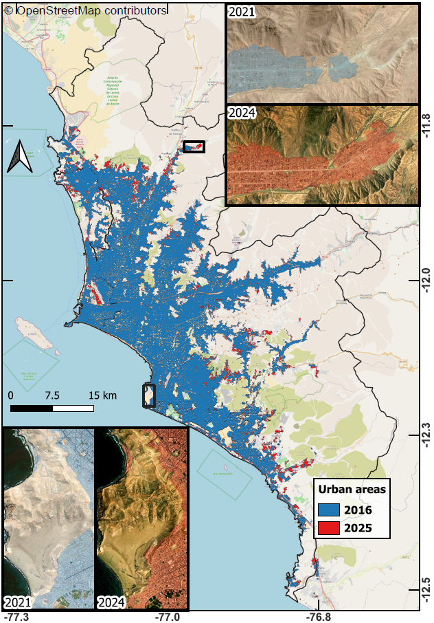

# **Crecimiento urbano en Lima Metropolitana (2016-2025)**

Este repositorio está dedicado a presentar los resultados del proyecto **"PE501091200-2024 - Monitoreo del crecimiento urbano en zonas vulnerables empleando imágenes satelitales e inteligencia artificial"** a nivel de Lima Metropolitana.
