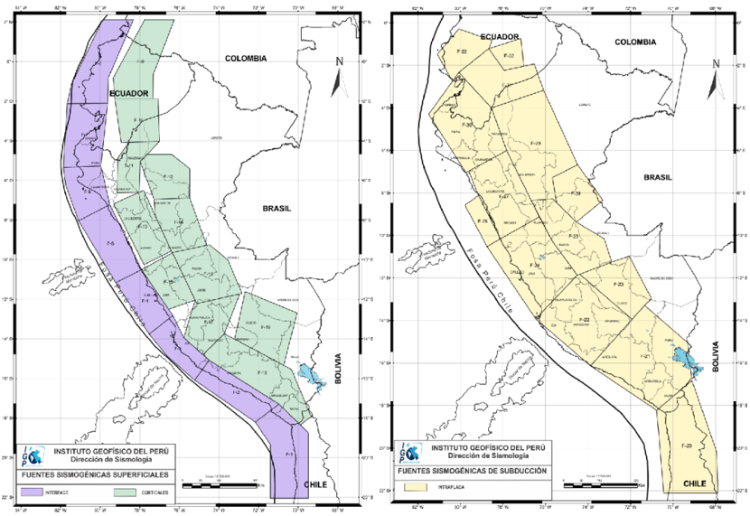

# Fuentes

Se consideran las 33 fuentes simogénicas propuestas en el estudio de Peligro Sísmico elaborado por el IGP en el año 2014, las cuales se clasifican en 3 tipos:

- Subducción interfase:F1-F8
- Cortical:F9-F19
- Subducción intraplacal: F20-F33

  
   
  <em>Fuente: Instituto Geofísico del Perú (IGP)</em>

