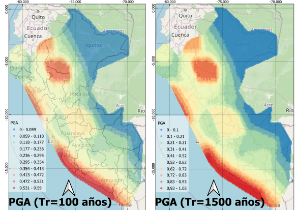

# Modelamiento Probabilístico en OpenQuake

OpenQuake es una plataforma de software de código abierto desarrollada por la Global Earthquake Model (GEM) Foundation para la evaluación del peligro y riesgo sísmico. A diferencia de herramientas más tradicionales, como CRISIS 2007, OpenQuake permite realizar análisis tanto deterministas como probabilistas del peligro sísmico, y además incluye módulos avanzados para la evaluación del riesgo sísmico (daños, pérdidas económicas, impactos sociales). Está basada en un motor altamente personalizable que puede ejecutarse desde línea de comandos, scripts en Python o a través de interfaces gráficas, lo cual la hace adecuada tanto para usuarios principiantes como para investigadores que requieren automatización y escalabilidad.

Entre las principales ventajas de OpenQuake frente a CRISIS 2007 se encuentra su mayor flexibilidad y capacidad para integrar modelos complejos, como fallas con geometría 3D, sistemas de fallas compuestas y modelos espacio-temporales de recurrencia sísmica. Además, OpenQuake es mantenido activamente, con soporte para formatos estándares como los de GEM y compatibilidad con bases de datos internacionales. También permite la evaluación conjunta del peligro y riesgo sísmico en grandes regiones, integrando componentes como vulnerabilidad y exposición. En resumen, OpenQuake representa una evolución moderna de las herramientas de evaluación sísmica, siendo más adecuada para estudios integrales, reproducibles y actualizados con las mejores prácticas internacionales.

## Modelo Probabilístico Peruano

El primer paso en el proceso consiste en generar el archivo job.ini, que establece los parámetros esenciales para la simulación de peligros sísmicos. En este archivo se define detalladamente el área de estudio, especificando las coordenadas geográficas que delimitan la región a analizar. Además, se establece la discretización espacial, lo que permite dividir el área en una malla que facilita la resolución del modelo sísmico. A través de este archivo, también se configuran los periodos de retorno correspondientes a diferentes niveles de riesgo sísmico, lo cual es fundamental para calcular las probabilidades de ocurrencia de terremotos de determinada magnitud durante un período de tiempo específico.

Además, en el archivo job.ini se definen los periodos estructurales, los cuales son utilizados para modelar la respuesta sísmica de las estructuras en función de sus características dinámicas. Estos periodos estructurales permiten ajustar el modelo sísmico a las condiciones específicas de las edificaciones que se encuentran en la región de estudio, facilitando la evaluación precisa del riesgo sísmico y el diseño adecuado de las infraestructuras.

```ini
[general]

description = Classical PSHA - Peru Completo
calculation_mode = classical
random_seed = 23

[geometry]

# NOTE: The vertices must follow the perimeter of the polygon
region = -79.078851449456508 -4.971487522642537,-78.344942107222167 -3.363796794509704,-77.832273626991807 -2.98902756060584 ,  -76.642150369314223 -2.588980547903999 ,  -75.374211360173078 -0.919072651510645 ,  -75.278086020129862 -0.790919828104117 ,  -75.28266341727479 -0.66276304753065 ,  -75.236889445825639 -0.557488897071435 ,  -75.392520948752718 -0.443058349571471 ,  -75.534420260245042 -0.182150821112058 ,  -75.616813408853503 -0.200460307553203 ,  -75.616813408853503 -0.104335318815549 ,  -75.209425062956143 -0.026519624068195 ,  -74.797459319913912 -0.163841316069748 ,  -73.598181267946458 -1.253162134147509 ,  -72.701011427543335 -2.369471279310193 ,  -71.748912821401234 -2.140778829360091 ,  -70.924981335316645 -2.191094223407927 ,  -70.036966289203363 -2.639279516834813 ,  -69.945418346305075 -4.229301669253304 ,  -69.991192317754226 -4.32972362213345 ,  -72.966500461948272 -5.64299563645984 ,  -73.094667582005869 -6.407744208626311 ,  -73.65311003368538 -7.761361779862373 , -72.939036079078789 -8.984062356076777 ,  -72.298200478790847 -9.517168571690377 ,  -71.986937472936702 -10.013385139756654 ,  -71.382721049807984 -10.004369673791039 , -70.586253946592961 -9.429879169835163 , -70.491654405598084 -9.435899840102076 , -70.638131114235321 -10.877671918068939 , -69.588381369001738 -10.901645097418156 ,  -68.636282762859651 -12.527079253112726 , -68.880410610588328 -16.309322658752595 ,  -69.734858077638947 -18.012042644436622,  -70.003398710140544 -18.313595504882834 , -70.418416051279408 -18.336770253153325 ,  -75.203321866762749 -15.464039409987031 ,  -76.192039650064189 -14.343462589591834 , -80.030950055598638 -6.732120479084565 ,  -81.105112585605099 -6.077092702859305 ,  -81.288208471401632 -4.27799274560899 ,  -80.531412143442537 -3.510771481573941 , -80.250665118554494 -3.449852082727109
# region grid spacing in km
region_grid_spacing = 10.0

[logic_tree]
# 0 samples means we are using the entire logic tree
number_of_logic_tree_samples = 0

[erf]
width_of_mfd_bin = 0.2
# discretizations are in km
# for simple faults
rupture_mesh_spacing = 10.0
# for area sources
area_source_discretization = 15.0
# for complex faults
complex_fault_mesh_spacing = 15.0


[site_params]

reference_vs30_type = measured
reference_vs30_value = 760.0
# used in some specific GMPEs, this can be a csv file
reference_depth_to_2pt5km_per_sec = 5.0
reference_depth_to_1pt0km_per_sec = 100.0

[calculation]
source_model_logic_tree_file = source_model_logic_tree.xml
gsim_logic_tree_file = gmpe_logic_tree_per2014.xml

# years
investigation_time = 50.0

# IMLs in units of g. Two ways to specify: logscale or array
intensity_measure_types_and_levels = {"PGA": [0.005, 0.007, 0.010, 0.014, 0.019, 0.027, 0.038, 0.053, 0.074, 0.103, 0.145, 0.203, 0.284, 0.398, 0.557, 0.780, 1.093, 1.530, 2.142, 3.000],
                                      "SA(0.1)": logscale(0.005, 4.00, 20),
                                      "SA(0.2)": logscale(0.005, 4.00, 20),
                                      "SA(0.4)": logscale(0.005, 3.00, 20),
                                      "SA(0.7)": logscale(0.005, 3.00, 20),
                                      "SA(1.0)": logscale(0.005, 2.00, 20),
                                      "SA(2.0)": logscale(0.005, 2.00, 20)}

#of the Gaussian distribution of the the logarithm of ground motion used in the calculation of hazard
truncation_level = 3

# integration distance in km (J&B distance)
maximum_distance = {'Subduction Interface': 300.,'Active Shallow Crust': 200.,'default': 200.}


[output]

export_dir = ./tmp
mean_hazard_curves = True
quantile_hazard_curves = 0.15, 0.50, 0.85
hazard_maps = True
uniform_hazard_spectra = True

# using the POEs for return periods of 2475,1500, 975, 475, 225, and 75 years
poes = 0.020 0.033 0.05 0.1 0.20 0.5
individual_curves = True
```

Se crea un archivo .xml que asigna las leyes de atenuación a las diversas fuentes sísmicas, lo cual es esencial para modelar el comportamiento de las ondas sísmicas a medida que se propagan a través de la corteza terrestre. Este archivo también incluye árboles de decisión, que permiten incorporar los errores epistémicos en el modelo sísmico. Los árboles de decisión son una herramienta poderosa para manejar la incertidumbre inherente a las predicciones sísmicas, permitiendo seleccionar las mejores leyes de atenuación en función de distintos escenarios y parámetros. De este modo, se garantiza que las estimaciones de peligro sísmico sean más robustas, considerando diferentes hipótesis y aproximaciones.

El archivo .xml no solo define las leyes de atenuación, sino que también organiza la información de manera estructurada, facilitando la integración de diferentes modelos de fuentes sísmicas y las correspondientes funciones de atenuación. Este enfoque asegura que los resultados del análisis sísmico sean coherentes y adaptables a las variaciones en los parámetros de entrada, considerando tanto los aspectos físicos como las incertidumbres epistemológicas que podrían afectar la precisión de las predicciones de peligro sísmico.

```ini
<?xml version="1.0" encoding="UTF-8"?>

<nrml xmlns:gml="http://www.opengis.net/gml"
      xmlns="http://openquake.org/xmlns/nrml/0.4">
    <logicTree logicTreeID="lt1">

<!-- 1.0 Logic Tree for Active Shallow Crust -->

        <logicTreeBranchingLevel branchingLevelID="_bl01">
            <logicTreeBranchSet branchSetID="_bs01" uncertaintyType="gmpeModel"
                    applyToTectonicRegionType="Active Shallow Crust">

                <logicTreeBranch branchID="b11">
                    <uncertaintyModel>BooreAtkinson2008</uncertaintyModel>
                    <uncertaintyWeight>0.3</uncertaintyWeight>
                </logicTreeBranch>

                <logicTreeBranch branchID="b12">
                    <uncertaintyModel>ChiouYoungs2008</uncertaintyModel>
                    <uncertaintyWeight>0.3</uncertaintyWeight>
                </logicTreeBranch>

                <logicTreeBranch branchID="b13">
                    <uncertaintyModel>CampbellBozorgnia2014</uncertaintyModel>
                    <uncertaintyWeight>0.2</uncertaintyWeight>
                </logicTreeBranch>

                <logicTreeBranch branchID="b14">
                    <uncertaintyModel>AbrahamsonSilva2008</uncertaintyModel>
                    <uncertaintyWeight>0.2</uncertaintyWeight>
                </logicTreeBranch>

            </logicTreeBranchSet>
        </logicTreeBranchingLevel>

<!-- 2.0 Logic Tree for Interface Zone -->

        <logicTreeBranchingLevel branchingLevelID="_bl02">

            <logicTreeBranchSet branchSetID="_bs02" uncertaintyType="gmpeModel"
                    applyToTectonicRegionType="Subduction Interface">

                <logicTreeBranch branchID="b21">
                    <uncertaintyModel>AbrahamsonEtAl2015SInter</uncertaintyModel>
                    <uncertaintyWeight>0.20</uncertaintyWeight>
                </logicTreeBranch>

                <logicTreeBranch branchID="b22">
                    <uncertaintyModel>MontalvaEtAl2016SInter</uncertaintyModel>
                    <uncertaintyWeight>0.20</uncertaintyWeight>
                </logicTreeBranch>
                    
                <logicTreeBranch branchID="b23">
                    <uncertaintyModel>ZhaoEtAl2006SInter</uncertaintyModel>
                    <uncertaintyWeight>0.20</uncertaintyWeight>
                </logicTreeBranch>
                <logicTreeBranch branchID="b24">
                    <uncertaintyModel>YoungsEtAl1997SInter</uncertaintyModel>
                    <uncertaintyWeight>0.20</uncertaintyWeight>
                </logicTreeBranch>

                <logicTreeBranch branchID="b25">
                    <uncertaintyModel>LinLee2008SInter</uncertaintyModel>
                    <uncertaintyWeight>0.20</uncertaintyWeight>
                </logicTreeBranch>

            </logicTreeBranchSet>
        </logicTreeBranchingLevel>

        <logicTreeBranchingLevel branchingLevelID="_bl03">

            <logicTreeBranchSet branchSetID="_bs03" uncertaintyType="gmpeModel"
                    applyToTectonicRegionType="Subduction IntraSlab">

                <logicTreeBranch branchID="b31">
                    <uncertaintyModel>AbrahamsonEtAl2014</uncertaintyModel>
                    <uncertaintyWeight>0.5</uncertaintyWeight>
                </logicTreeBranch>
                <logicTreeBranch branchID="b32">
                    <uncertaintyModel>ZhaoEtAl2006SSlab</uncertaintyModel>
                    <uncertaintyWeight>0.5</uncertaintyWeight>
                </logicTreeBranch>

            </logicTreeBranchSet>

        </logicTreeBranchingLevel>

    </logicTree>
</nrml>
```

Se generan dos archivos adicionales en formato .xml que son fundamentales para la definición detallada de las fuentes generadoras de sismos y la implementación de árboles de decisión. El primer archivo define las fuentes sísmicas, especificando su ubicación, tipo y características geofísicas, lo que permite modelar con precisión la actividad sísmica en la región de estudio. El segundo archivo, dedicado a los árboles de decisión, tiene como objetivo reducir los errores de las fuentes generadoras mediante la incorporación de diferentes escenarios y consideraciones epistémicas. Estos árboles de decisión permiten evaluar la probabilidad de ocurrencia de distintos eventos sísmicos y seleccionar las fuentes más representativas para cada caso, considerando las variaciones en la información y reduciendo la incertidumbre asociada al modelo.

```ini
<?xml version="1.0" encoding="UTF-8"?>
<nrml xmlns:gml="http://www.opengis.net/gml"
      xmlns="http://openquake.org/xmlns/nrml/0.4">
    <logicTree logicTreeID="lt1">
        <logicTreeBranchingLevel branchingLevelID="bl1">
            <logicTreeBranchSet uncertaintyType="sourceModel"
                                branchSetID="bs1">
                <logicTreeBranch branchID="b1">
			    <uncertaintyModel>source_model_Peru_Grupo1.xml</uncertaintyModel>
                    <uncertaintyWeight>1.0</uncertaintyWeight>
                </logicTreeBranch>
            </logicTreeBranchSet>
        </logicTreeBranchingLevel>
    </logicTree>
</nrml>
```

<p align="center">
  
  <br>
  <em>Fuente: Elaborado por Javier Alonso Jaimes Cucho</em>
</p>
