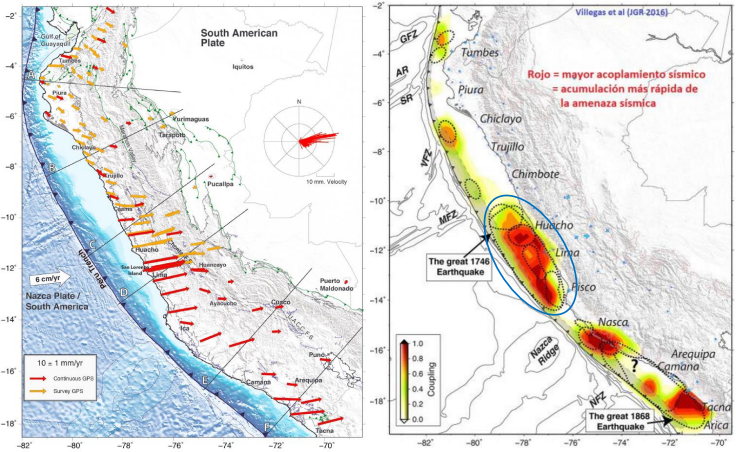

# Peligro Sísmico

La prolongada ausencia de rupturas significativas en la zona central del Perú desde el sismo de 1746 (silencio sísmico) sugiere una acumulación crítica de energía que incrementa la probabilidad de un evento extremo de subducción.

  
   
  <em>Fuente: Instituto Geofísico del Perú (IGP)</em>

En este módulo se presentará una introducción a la Evaluación Probabilistica de Peligro Sísmico (PSHA), fuentes generadoras en el Perú y modelamiento numérico en los software Crisis2007 y OpenQuake.

## PSHA

El **PSHA** se basa en considerar todas las combinaciones posibles —pero físicamente relevantes— de eventos sísmicos que podrían afectar un sitio, junto con sus tasas de ocurrencia. Bajo este enfoque, el peligro sísmico se define como la **probabilidad** de que, en un sitio específico, ocurra un sismo capaz de generar una intensidad igual o mayor que un umbral dado dentro de un periodo de tiempo determinado.

Esta probabilidad se calcula asumiendo que los sismos siguen un proceso de **Poisson**, lo que implica que:

- La ocurrencia de eventos en un intervalo de tiempo es independiente de la ocurrencia en otros intervalos.
- La probabilidad de ocurrencia en un intervalo corto de tiempo es proporcional a la duración del mismo.
- La probabilidad de que más de un sismo ocurra en un intervalo de tiempo muy corto es despreciable.

Adicionalmente, se considera que la **intensidad sísmica** (**I**) en un sitio depende tanto del tamaño del sismo (representado por su magnitud **s**) como de su distancia (**r**) al sitio de interés. Estas variables se modelan como aleatorias continuas mediante funciones de densidad de probabilidad \\(f_s(s)\\) y \\(f_r(r)\\). Así, la probabilidad de que la intensidad sísmica supere un valor **i** se expresa como \\(P(I \geq i)\\), integrando las contribuciones de todos los posibles escenarios sismológicos y sus efectos en el sitio.

---

### Tasa anual de excedencia

La **tasa anual de excedencia** de una intensidad sísmica IM superior a un umbral x en un sitio específico se define como:

$$
\lambda(IM > x) = \sum_{i=1}^{N_s} \iint_S \int_{M_{min}}^{M_{max}} \int_{R_{min}}^{R_{max}} \nu_i(M) \cdot f_R(R|M) \cdot P(IM > x \mid M, R) \, dR \, dM \, dS
$$

donde:

- \\(N_s\\) es el número de fuentes sismogénicas consideradas.
- \\(nu_i(M)\\) representa la **tasa anual de ocurrencia** de sismos de magnitud M en la fuente i, obtenida a partir de su modelo de recurrencia sísmica.
- \\( f_R{(R \mid M)} \\)es la función de densidad de probabilidad de la distancia $R$ al sitio, condicional a la magnitud **M**.
- \\(P(IM > x \mid M, R)\\) es la probabilidad de que la intensidad del movimiento del suelo supere el valor **x**, dado un sismo de magnitud **M** a una distancia **R**, determinada a través de **leyes de atenuación** (GMPEs).

Esta integral se evalúa para cada fuente sismogénica y sus resultados se suman, obteniendo así la contribución total de todas las fuentes a la amenaza sísmica del sitio.

---

### Probabilidad de excedencia en un periodo de tiempo

A partir de esta tasa, se puede calcular la **probabilidad de excedencia** para un periodo de tiempo **T** mediante:

$$
P(IM > x; T) = 1 - e^{-\lambda(IM > x) \cdot T}
$$

bajo el supuesto de que los eventos sísmicos ocurren de manera independiente y conforme a un proceso de Poisson.

## Estimación de la Superficie de Ruptura Sísmica

La estimación de la superficie de ruptura sísmica puede abordarse mediante distintos modelos, siendo comunes aquellos que emplean relaciones exponenciales en función de la magnitud.

### Radio de ruptura

$$
R = \sqrt{\frac{K_1 e^{K_2 M}}{\pi}}
$$

### Valores empíricos

| **Referencia**                              | **\\(K_1\\)** | **\\(K_2\\)**  |
|--------------------------------------------|-----------|------------|
| Brune (1970)                                | 0.00381   | 1.15130    |
| _Singh et al. (1980)_                       | 0.00564   | 1.15130    |
| **Wells and Coppersmith (1994)** Strike-slip| 0.01100   | 1.03616    |
| **Wells and Coppersmith (1994)** Reverse    | 0.00571   | 1.12827    |
| **Wells and Coppersmith (1994)** Normal     | 0.02072   | 0.94406    |
| **Wells and Coppersmith (1994)** All        | 0.01015   | 1.04768    |

## Estimación de la Variabilidad del Parámetro \\(\beta\\)

El coeficiente de variación del parámetro \\(\beta\\) en el modelo de Gutenberg-Richter se puede estimar utilizando el método de máxima verosimilitud (MLE), mediante el cálculo de la varianza del estimador $\hat{\beta}$:

$$
CV_{\beta} = \frac{\sigma_{\beta}}{\beta} = \frac{1}{\sqrt{n}}
$$

## Estimación del Valor Extremo de Magnitud Truncada \\(M_u\\)

Para la estimación del valor extremo de magnitud truncada \\(M_u\\), se puede emplear el método propuesto por **Kijko & Graham (1998)**. De manera conservadora, en ausencia de una base de datos suficientemente robusta, se recomienda asumir como valor esperado de \\(M_u\\):

- el máximo del catálogo + 0.2 a 0.3 unidades,  
- con un coeficiente de variación (CV) de aproximadamente **0.2**.

# Modelos de Atenuación (GMPEs) en el Contexto Sísmico Peruano

Existe una amplia variedad de modelos de atenuación (Ground Motion Prediction Equations, GMPEs) desarrollados internacionalmente. Varios de estos han sido evaluados y recomendados para representar adecuadamente la amenaza sísmica en el Perú, considerando tanto eventos de **subducción** (interplaca e intraplaca) como **eventos corticales** (fallas superficiales).

A continuación se detallan algunos de los modelos comúnmente empleados y disponibles en **OpenQuake**, clasificados por tipo de fuente sísmica.

## Subducción Interplaca (Interface)

### `YoungsEtAl1997SInter`
- Uno de los primeros modelos ampliamente utilizados para zonas de subducción.
- Basado en eventos en el Pacífico, Japón y México.
- Abarca un amplio rango de magnitudes y distancias.

### `ZhaoEtAl2006SInter`
- Desarrollado para Japón usando una base de datos extensa y moderna.
- Incluye efectos de profundidad focal y mecanismos de ruptura.
- Compatible con condiciones locales variables.

### `AbrahamsonEtAl2015SInter`
- Parte del conjunto de modelos NGA-Subduction.
- Incorpora una base de datos global moderna.
- Ajustado para mejorar la estimación de incertidumbre epistemológica.

### `MontalvaEtAl2016SInter`
- Modelo latinoamericano con enfoque en Chile y Perú.
- Ajustado para condiciones geotectónicas similares a las de la región andina.
- Ofrece una opción más representativa para escenarios regionales.

## Subducción Intraplaca (Intraslab)

### `YoungsEtAl1997Subduction`
- Extensión del modelo de Youngs para eventos profundos intraplaca.
- Utilizado históricamente en varias regiones del Pacífico.

### `ZhaoEtAl2006SSlab`
- Variante del modelo japonés de Zhao para eventos intraslab.
- Considera diferencias en atenuación y mecanismos focales.

### `AbrahamsonEtAl2015SSlab`
- Parte del modelo NGA-Subduction para eventos en la losa.
- Representa bien la amplificación del movimiento sísmico en profundidad.

### `GhofraniAtkinson2014Intraslab`
- Desarrollado con datos de Canadá y compatible con zonas de subducción.
- Integra efectos de sitio y parámetros de distancia más precisos para losas profundas.

## Falla Cortical (Crustal)

### `BooreAtkinson2008`
- Modelo NGA para eventos someros en falla cortical.
- Incluye efecto de sitio Vs30 y términos de distancia ajustados.
- Recomendado para estructuras cercanas a fuentes superficiales.

### `ChiouYoungs2008`
- Otro modelo NGA de amplio uso, basado en datos globales.
- Incorpora parámetros como profundidad, tipo de ruptura y Vs30.

### `CampbellBozorgnia2014`
- Modelo NGA-West2 con enfoque en rupturas someras.
- Mejorado con nuevos términos para directividad y mecanismos de falla.

### `AbrahamsonSilva2008`
- Parte de NGA-West1, ampliamente utilizado en escenarios urbanos.
- Considera incertidumbre aleatoria y variabilidad regional.

---

> **Nota:** Para aplicaciones en Perú, es recomendable seleccionar GMPEs considerando tanto el tipo de evento como la geología local, realizando ajustes o ponderaciones si se emplean en conjunto mediante lógica de rama lógica (logic tree).

A continuación se presentan los siguientes submodulos:

